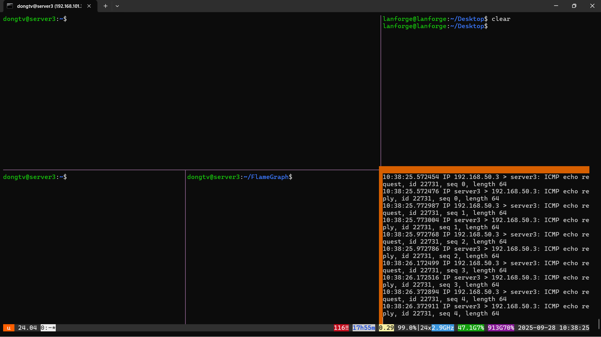

# HƯỚNG DẪN ĐO CPU USAGE TRÊN USERSPACE

## 1. Truy cập server3 bằng tailscale
- Gửi gmail để được add vào node tailscale
- Sử dụng lệnh sau để ssh vào server3: 
```bash
ssh dongtv@<IP server3>
```
- Mật khẩu server3 và lanforge: 1   

**BẮT ĐẦU TỪ ĐÂY, MỞ 2 TAB LÀM VIỆC**
## 2. Switch giữa các branch trong code (Làm ở VS code):
- Truy cập vào server3, kiểm tra xem đang nằm ở branch nào:
```bash
cd dtuan/xdp-program
git branch
```
- Mình đo với các branch sau:
    + supervised_lof
    + knn_threshold
    + random_forest
    + isolation_forest
- Để đổi các branch, làm như sau:
```bash
git switch <Tên branch>
```
- Thông số thay đổi cho các branch như sau:
    + supervised_lof: Thay đổi `MAX_FLOW_SAVED` (Từ 200 đến 1000 mỗi lần tăng 200).
    + knn_threshold: Thay đổi `MAX_FLOW_SAVED` (Từ 200 đến 1000 mỗi lần tăng 200).
    + random_forest: Thay đổi `MAX_TREES` (Từ 10 đến 60 mỗi lần tăng 10)
    + isolation_forest: Thay đổi `MAX_TREES` (Từ 10 đến 60 mỗi lần tăng 10)
- Mỗi lần thay đổi tham số xong hoặc mỗi lần switch branch thì đều phải thực hiện lệnh sau:
```bash
make
```
## 3. Thực hiện trên terminal như sau:
- Mở một terminal ở máy tính, ssh vào server3 với câu lệnh ssh như ở phần 1.
- Sau khi ssh vào, gõ lệnh sau:
```bash
byobu
```
Sau khi gõ lệnh trên, màn hình hiển thị như sau:


- Góc phải dưới chạy lệnh:
```bash
sudo tcpdump -i eno3
```
- Click chuột vào ô góc trái bên dưới, chạy lệnh sau:
```bash
./dtuan/run_xdp_program.sh
```
- Tiếp theo đến góc phải trên, chạy lệnh sau:
```bash
./scripts_tcpreplay.sh enp1s0f1 pcap/data_portmap.pcap <số pps> 120 cpu_usage_userspace/<Tên branch>_<Tham số điều chỉnh>.log
```
Số pps thay đổi từ 10000 đến 100000 mỗi lần tăng 10000
## Đo mỗi tham số 5 lần
## Tóm tắt cách đo như sau:
1. Đổi branch -> Điều chỉnh tham số -> make
2. Chạy scripts run_xdp_program
3. Phát tấn công bằng ./scripts_tcpreplay.sh

Vậy với mỗi thuật toán phải điều chỉnh các tham số như trên, và phát tấn công với số pps khác nhau, lưu ý phải đổi tên file để dễ phân biệt.